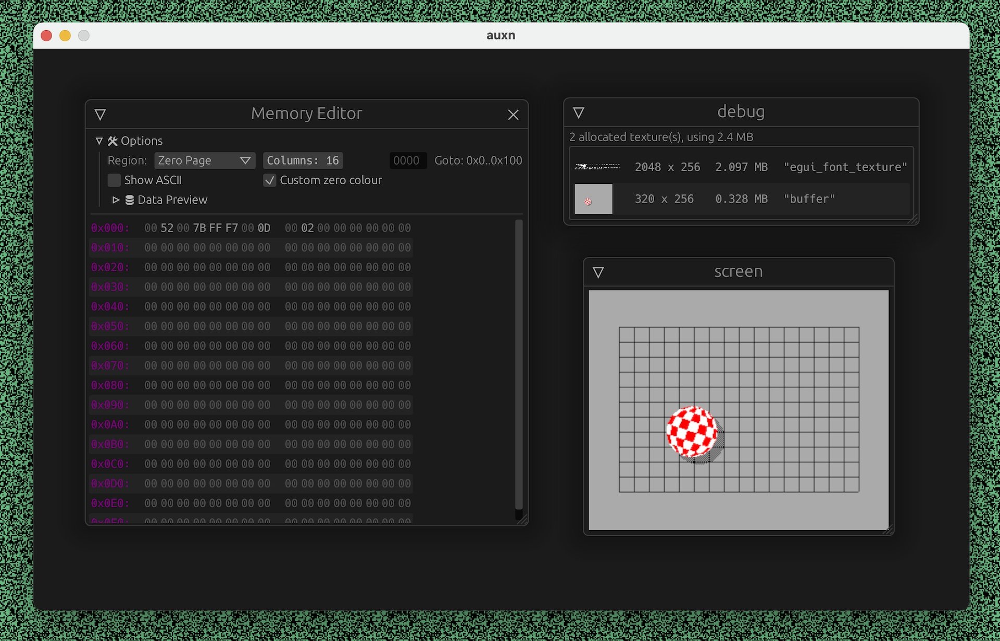

# talsnd

uxn virtual machine running inside of a audio plugin

🚧🚧🚧 very much in progress 🚧🚧🚧

*whats inside?*

- a reimplementation of uxn in rust (functional but could really use some structuring) [DONE]
- custom-varvara implementation runnning as a vst

## tests passed
- [x] arithmetic.rom
- [x] literals.rom
- [x] jumps.rom
- [x] memory.rom
- [x] stack.rom

### special thanks to:
- rekka and devine for creating uxn
- compudanzas and their amazing uxn tutorial
- the c2rust team which helped a lot in this port
